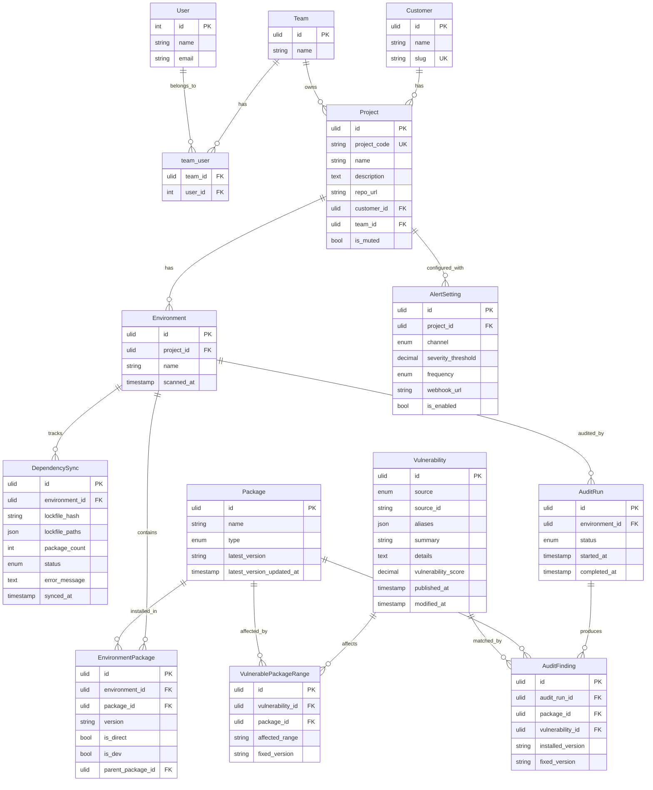

# Data Model Diagram

```mermaid
erDiagram
    Customer {
        ulid id PK
        string name
        string slug UK
    }

    Team {
        ulid id PK
        string name
    }

    User {
        int id PK
        string name
        string email
    }

    Team ||--o{ team_user : has
    User ||--o{ team_user : belongs_to
    team_user {
        ulid team_id FK
        int user_id FK
    }

    Customer ||--o{ Project : has
    Team ||--o{ Project : owns

    Project {
        ulid id PK
        string project_code UK
        string name
        text description
        string repo_url
        ulid customer_id FK
        ulid team_id FK
        bool is_muted
    }

    Project ||--o{ Environment : has

    Environment {
        ulid id PK
        ulid project_id FK
        string name
        timestamp scanned_at
    }

    Environment ||--o{ DependencySync : tracks

    DependencySync {
        ulid id PK
        ulid environment_id FK
        string lockfile_hash
        json lockfile_paths
        int package_count
        enum status
        text error_message
        timestamp synced_at
    }

    Environment ||--o{ EnvironmentPackage : contains
    Package ||--o{ EnvironmentPackage : installed_in

    Package {
        ulid id PK
        string name
        enum type
        string latest_version
        timestamp latest_version_updated_at
    }

    EnvironmentPackage {
        ulid id PK
        ulid environment_id FK
        ulid package_id FK
        string version
        bool is_direct
        bool is_dev
        ulid parent_package_id FK
    }

    Environment ||--o{ AuditRun : audited_by

    AuditRun {
        ulid id PK
        ulid environment_id FK
        enum status
        timestamp started_at
        timestamp completed_at
    }

    AuditRun ||--o{ AuditFinding : produces
    Package ||--o{ AuditFinding : flagged_in
    Vulnerability ||--o{ AuditFinding : matched_by

    AuditFinding {
        ulid id PK
        ulid audit_run_id FK
        ulid package_id FK
        ulid vulnerability_id FK
        string installed_version
        string fixed_version
    }

    Vulnerability {
        ulid id PK
        enum source
        string source_id
        json aliases
        string summary
        text details
        decimal vulnerability_score
        timestamp published_at
        timestamp modified_at
    }

    Vulnerability ||--o{ VulnerablePackageRange : affects
    Package ||--o{ VulnerablePackageRange : affected_by

    VulnerablePackageRange {
        ulid id PK
        ulid vulnerability_id FK
        ulid package_id FK
        string affected_range
        string fixed_version
    }

    AlertSetting {
        ulid id PK
        ulid project_id FK
        enum channel
        decimal severity_threshold
        enum frequency
        string webhook_url
        bool is_enabled
    }

    Project ||--o{ AlertSetting : configured_with
```
